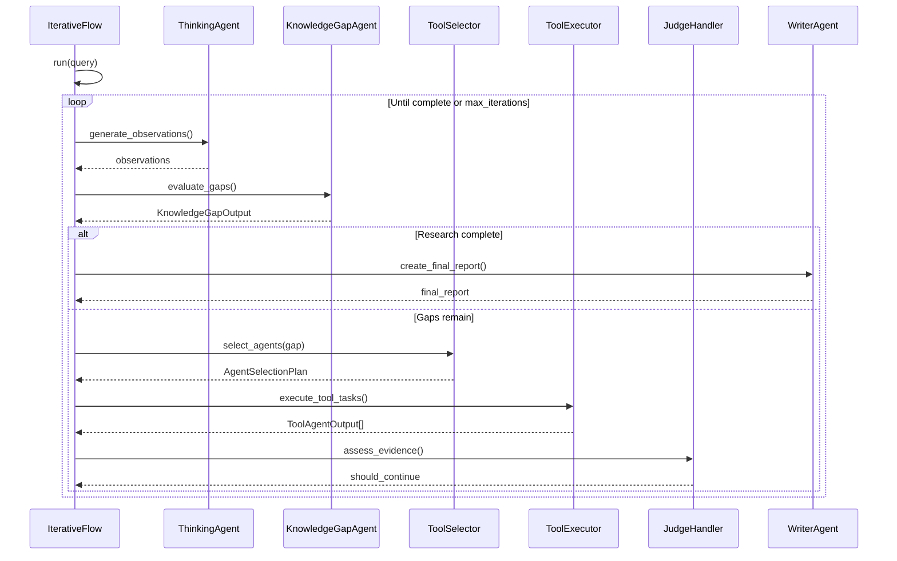
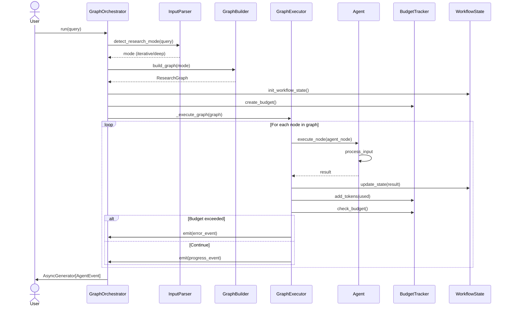

<div align="center">

[](https://github.com/DeepCritical/GradioDemo)
[](docs/index.md)
[](https://huggingface.co/spaces/DataQuests/DeepCritical)
[](https://codecov.io/gh/DeepCritical/GradioDemo)
[](https://discord.gg/qdfnvSPcqP) 


</div>


# DeepCritical

## Intro

## Features

- **Multi-Source Search**: PubMed, ClinicalTrials.gov, bioRxiv/medRxiv
- **MCP Integration**: Use our tools from Claude Desktop or any MCP client
- **HuggingFace OAuth**: Sign in with your HuggingFace account to automatically use your API token
- **Modal Sandbox**: Secure execution of AI-generated statistical code
- **LlamaIndex RAG**: Semantic search and evidence synthesis
- **HuggingfaceInference**: Free tier support with automatic fallback
- **HuggingfaceMCP Custom Config To Use Community Tools**:
- **Strongly Typed Composable Graphs**:
- **Specialized Research Teams of Agents**: 

## Quick Start

### 1. Environment Setup

```bash
# Install uv if you haven't already
pip install uv

# Sync dependencies
uv sync
```

### 2. Run the UI

```bash
# Start the Gradio app
uv run gradio run src/app.py
```

Open your browser to `http://localhost:7860`.

### 3. Authentication (Optional)

**HuggingFace OAuth Login**:
- Click the "Sign in with HuggingFace" button at the top of the app
- Your HuggingFace API token will be automatically used for AI inference
- No need to manually enter API keys when logged in
- OAuth token is used only for the current session and never stored

**Manual API Key (BYOK)**:
- You can still provide your own API key in the Settings accordion
- Supports HuggingFace, OpenAI, or Anthropic API keys
- Manual keys take priority over OAuth tokens

### 4. Connect via MCP

This application exposes a Model Context Protocol (MCP) server, allowing you to use its search tools directly from Claude Desktop or other MCP clients.

**MCP Server URL**: `http://localhost:7860/gradio_api/mcp/`

**Claude Desktop Configuration**:
Add this to your `claude_desktop_config.json`:
```json
{
  "mcpServers": {
    "deepcritical": {
      "url": "http://localhost:7860/gradio_api/mcp/"
    }
  }
}
```

**Available Tools**:
- `search_pubmed`: Search peer-reviewed biomedical literature.
- `search_clinical_trials`: Search ClinicalTrials.gov.
- `search_biorxiv`: Search bioRxiv/medRxiv preprints.
- `search_all`: Search all sources simultaneously.
- `analyze_hypothesis`: Secure statistical analysis using Modal sandboxes.


## Architecture

DeepCritical uses a Vertical Slice Architecture:

1.  **Search Slice**: Retrieving evidence from PubMed, ClinicalTrials.gov, and bioRxiv.
2.  **Judge Slice**: Evaluating evidence quality using LLMs.
3.  **Orchestrator Slice**: Managing the research loop and UI.

- iterativeResearch
- deepResearch
- researchTeam

### Iterative Research




### Deep Research



### Research Team

Critical Deep Research Agent

## Development

### Run Tests

```bash
uv run pytest
```

### Run Checks

```bash
make check
```

## Links

- [GitHub Repository](https://github.com/DeepCritical/GradioDemo)